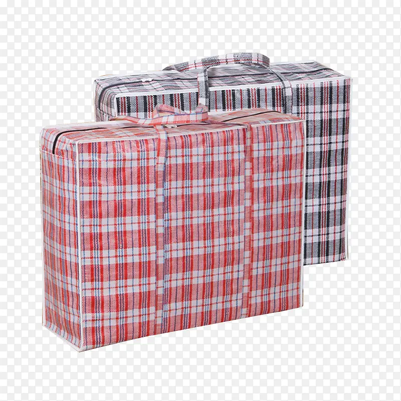
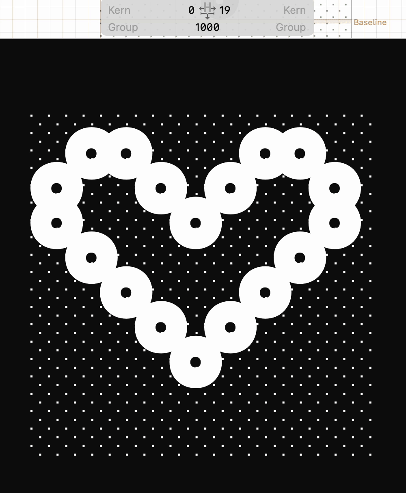

## About BianZhiDai 2.0

**bianzhidai** is inspired by shading characters in ASCII art and 编 织 袋 Biān Zhī Daì (woven plastic bag in Simple Chinese). 
Previously constructed in [GDC](http://glyphdrawing.club) 
(glyphdrawingclub, designed and developed by @hlotvonen and @i-tu ), turned into modular when doing the revision. **bianzhidai** is good with colors, especially in combination with different fill/stroke colors. Try it, and play it. Besides, the whole font is modular based, so you can customize it in [Glyphs](https://glyphsapp.com/) any way you like.
 
**bianzhidai 2.0** is an updated version, which is intended to provide a stead(ier) structure for the characters, more decorative/playful styles and (slightly) enhanced readbility. With ten styles: Base, Cube, Stitches, Ring, Pearl, Bubble, Messy, Messier, Brush, and Cloud. 
(Hooo, long list...)

Hope you will enjoy it! <3

## Designer

[Xiaoyuan Gao](https://notyourtype.nl)

Xiaoyuan Gao(CN) is a Rotterdam-based freelance graphic designer, image-maker, type designer and the initiator of “notyourtype foundry”. She loves experimenting with unconventional approaches to type design and typesetting. She sees type design (making custom characters into a font file) as making a tool for typing, just like a customised typewriter. She also enjoys creating visuals out of found images , which allows her to combine typography and imagery in playful ways. 

## License 
Bianzhidai is licensed under the SIL Open Font License, version 1.1.

## Credit (the typeface and its designer)

Crediting the typeface and its designer is crucial, as it shows appreciation for the generosity of designers who are willing to offer their fonts as open-source. It's noticeable that some individuals neglect to credit open-source typefaces and their designers. Acknowledging and appreciating these creative contributions is important. 

ANYWAYS, JUST CREDIT THE DESIGNER, OKAY? <3

## Publisher
[Velvetyne Type Foundry](https://velvetyne.fr/)

## Co-publisher
[notyourtype foundry](https://notyourtype.nl)

## Reference 

## Styles

## GIF

## Previous Version - BianZhiDai 1.0
[bianzhidai 1.0](https://github.com/sdfggvfvj/bianzhidai)