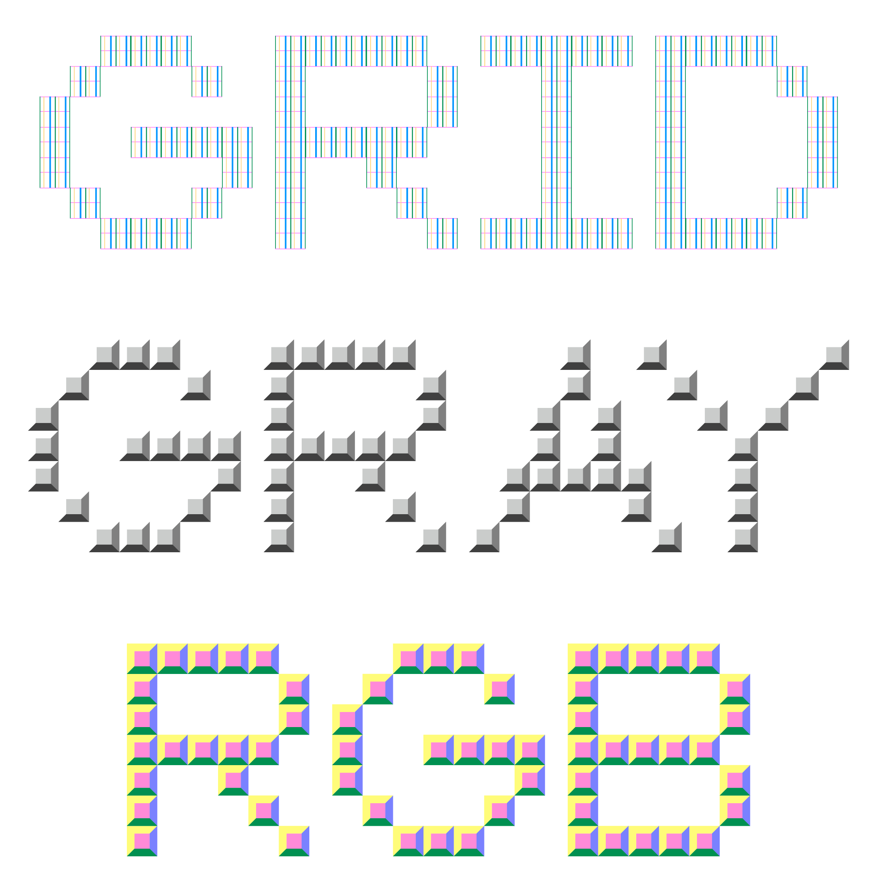
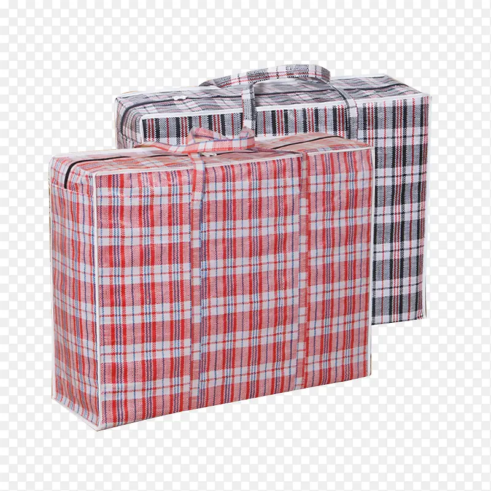
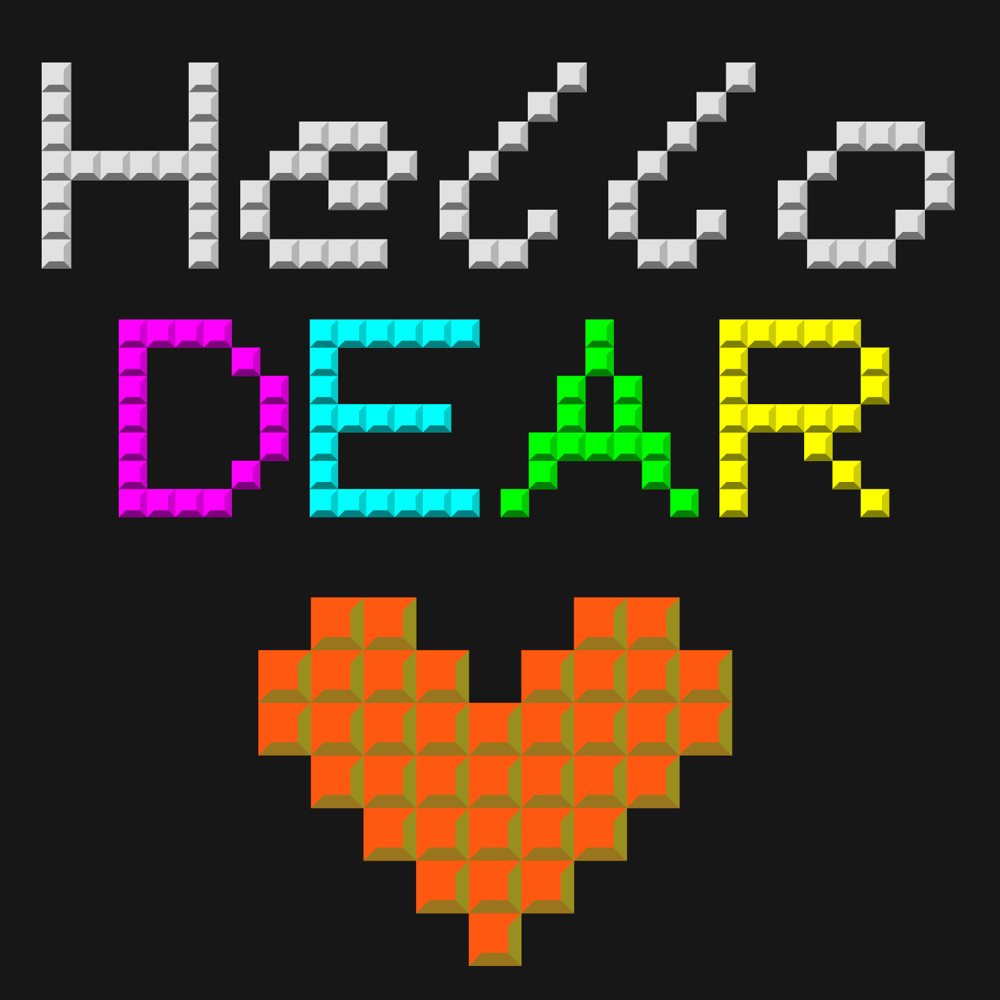
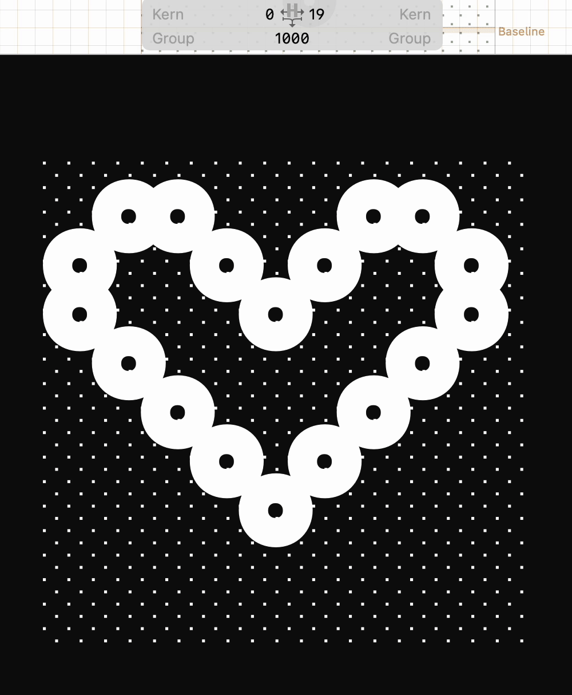

## Update (2026.02.26)
This typeface was previously released under the SIL Open Font License 1.1. As of March 2026, it is now licensed under the Free To Use BUT Be Nice License. Prior downloads under the SIL OFL 1.1 remain valid under that license.

-- Xiaoyuan (notyourtypefoundry)
## Update (2024.09.10)

Okay, recently I'm very obssesed with color fonts, so here you go:
ADDED 3 new styles for bianzhidai_COLR
Now you can use **OTF -> for print and display**
and WOFF -> **for web display**
e~n~j~o~y.

## About BianZhiDai 2.0 ⚡⚡⚡

**bianzhidai** is inspired by shading characters in ASCII art and 编 织 袋 Biān Zhī Daì (woven plastic bag in Simple Chinese). 
Previously constructed in [GDC](http://glyphdrawing.club) 
(glyphdrawingclub, an online drawing tool made by @hlotvonen and @i-tu ), turned into modular when doing the revision. 

**bianzhidai** is good with colors, especially in combination with different fill/stroke colors. Try it, and play it. Besides, the whole font is modular based, so you can customize it in [Glyphs](https://glyphsapp.com/) any way you like.
 
**bianzhidai 2.0** is an updated version, which is intended to provide a stead(ier) structure for the characters, more decorative/playful styles and (slightly) enhanced readbility. With ten styles: Base, Cube, Stitches, Ring, Pearl, Bubble, Messy, Messier, Brush, and Cloud. 
(Hooo, long list...) **There is an additional 4 styles for a layered color font: bianzhidai_COLR back, side, front and hightlight.**

Hope you will enjoy it! ٩(◕‿◕｡)۶

## Designer 👀

[Xiaoyuan Gao](https://notyourtype.nl)

Xiaoyuan Gao(CN) is a Rotterdam-based freelance graphic designer, image-maker, type designer and the initiator of “notyourtype foundry”. She loves experimenting with unconventional approaches to type design and typesetting. She sees type design (making custom characters into a font file) as making a tool for typing, just like a customised typewriter. She also enjoys creating visuals out of found images , which allows her to combine typography and imagery in playful ways. 

## License ⚡
Bianzhidai is licensed under the SIL Open Font License, version 1.1.

## Publisher 💿
[Velvetyne Type Foundry](https://velvetyne.fr/)

## Co-publisher 💿 💿
[notyourtype foundry](https://notyourtype.nl)

## Download & Install

> [!WARNING]  
> To use the "bianzhidai" font, it is mandatory to credit the designer, [Xiaoyuan Gao, notyourtype foundry](https://notyourtype.nl/) and Velvetyne Type Foundry. Acknowledging and appreciating creative contributions is essential. So, please ensure you give appropriate credit to the typeface and designer.

[By clicking this link, you agree to credit the designer. Download bianzhidai font here!](https://github.com/sdfggvfvj/bianzhidai-2.0/archive/refs/heads/main.zip)

## Credit 🪴

This is the line you can copy to credit the font:
**BianZhiDai by Xiaoyuan Gao, notyourtypefoundry. Distributed by velvetyne.fr.**

## Reference 🏞️

## Styles 🦥

yes, try "bianzhidai-COLR", maybe you will like it :-)

## GIF 🔨🪜🪴

## Previous Version - BianZhiDai 1.0 🧀
[bianzhidai 1.0](https://github.com/sdfggvfvj/bianzhidai)